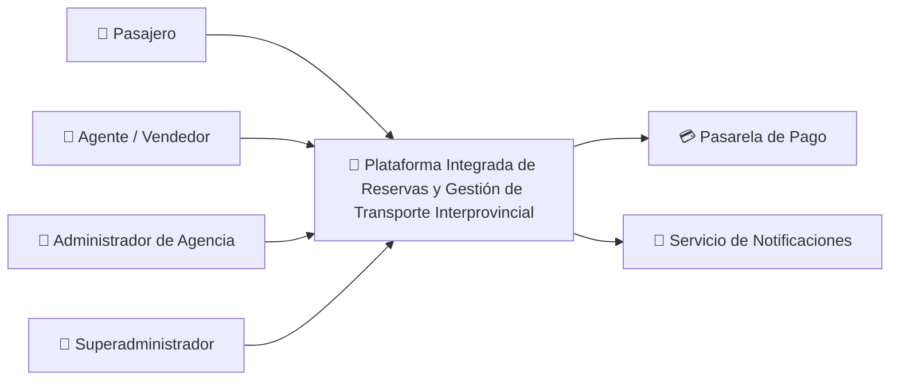

# Actores del Sistema

## 1. Comprensión del caso de negocio

El transporte interprovincial en Ayacucho está conformado por diferentes empresas y agencias que administran de manera independiente sus rutas, horarios, tarifas y disponibilidad de cupos o asientos. Esta fragmentación dificulta que los pasajeros puedan consultar y comparar de manera centralizada las diferentes alternativas de viaje disponibles.

La plataforma propuesta busca integrar progresivamente a las empresas y agencias de transporte en un único sistema para centralizar la consulta, reserva y adquisición de pasajes, manteniendo la independencia operativa de cada organización. Además, deberá controlar las operaciones concurrentes para evitar problemas como la sobreventa o la asignación duplicada de un mismo cupo o asiento durante periodos de alta demanda.

## 2. Identificación de actores

Los actores son las personas o sistemas externos que interactúan directamente con la Plataforma Integrada de Reservas y Gestión de Transporte Interprovincial.

### 2.1 Actores humanos

| Actor | ¿Qué necesita realizar? |
|---|---|
| **Pasajero** | Consultar viajes por origen, destino y fecha; revisar horarios, tarifas y disponibilidad; seleccionar cupos o asientos; realizar reservas y compras; consultar sus operaciones y recibir notificaciones sobre cambios del servicio. |
| **Agente/Vendedor** | Consultar servicios y disponibilidad, registrar reservas o ventas y atender las operaciones correspondientes a la agencia en la que se encuentra asignado. |
| **Administrador de Agencia** | Gestionar rutas, horarios, unidades de transporte, tarifas, servicios y disponibilidad correspondientes a su agencia, además de consultar información y reportes según sus permisos. |
| **Superadministrador** | Registrar y administrar empresas de transporte, agencias, usuarios y configuraciones generales de la plataforma, además de supervisar la operación global del sistema. |

### 2.2 Sistemas externos

| Sistema externo | Interacción con la plataforma |
|---|---|
| **Pasarela de pago** | Procesar los pagos asociados a la adquisición de pasajes y comunicar el resultado de la operación a la plataforma. |
| **Servicio de notificaciones** | Enviar confirmaciones y avisos relacionados con reservas, compras, modificaciones, reprogramaciones o cancelaciones mediante los medios electrónicos disponibles. |

## 3. Resumen de actores

La plataforma contará con cuatro actores humanos principales: Pasajero, Agente/Vendedor, Administrador de Agencia y Superadministrador. Cada actor tendrá acceso a funcionalidades específicas de acuerdo con su rol, empresa y agencia.

Asimismo, la plataforma interactuará con servicios externos para procesar pagos y enviar notificaciones relacionadas con las operaciones realizadas.
## 4. Diagrama de actores

