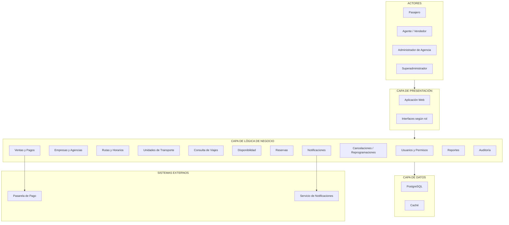

# Arquitectura en Capas

## 1. Descripción

La Plataforma Integrada de Reservas y Gestión de Transporte Interprovincial se organiza inicialmente mediante una arquitectura lógica de tres capas: Presentación, Lógica de Negocio y Datos.

Esta separación permite distribuir las responsabilidades del sistema y mantener una estructura organizada para facilitar su evolución, mantenimiento y escalabilidad.

## 2. Arquitectura lógica

### 2.1 Capa de Presentación

Responsable de la interacción entre los usuarios y la plataforma.

Incluye las interfaces utilizadas por:

- Pasajero.
- Agente/Vendedor.
- Administrador de Agencia.
- Superadministrador.

Principales responsabilidades:

- Mostrar la interfaz web de la plataforma.
- Permitir la búsqueda y consulta de viajes.
- Mostrar rutas, horarios, tarifas y disponibilidad.
- Permitir realizar reservas y compras.
- Proporcionar interfaces administrativas según el rol.
- Enviar las solicitudes del usuario hacia la lógica de negocio.

### 2.2 Capa de Lógica de Negocio

Contiene las reglas y procesos principales de la plataforma.

Se organiza en los siguientes módulos:

- Usuarios y permisos.
- Empresas y agencias.
- Rutas y horarios.
- Unidades de transporte.
- Consulta de viajes.
- Disponibilidad.
- Reservas.
- Ventas y pagos.
- Cancelaciones y reprogramaciones.
- Notificaciones.
- Reportes.
- Auditoría.

Esta capa debe aplicar las reglas necesarias para mantener la consistencia de las operaciones, especialmente durante procesos concurrentes de reserva.

### 2.3 Capa de Datos

Responsable de almacenar, consultar y mantener la información utilizada por la plataforma.

Gestiona información relacionada con:

- usuarios;
- empresas;
- agencias;
- rutas;
- horarios;
- unidades de transporte;
- servicios;
- disponibilidad;
- reservas;
- pagos;
- pasajes;
- operaciones de auditoría.

La arquitectura técnica propuesta utiliza PostgreSQL como base de datos transaccional y considera mecanismos de caché para reducir la carga generada por información consultada frecuentemente.

## 3. Sistemas externos

La plataforma requiere integración con servicios externos que no forman parte de las tres capas internas del sistema:

- **Pasarela de pago:** procesa las operaciones de pago relacionadas con la adquisición de pasajes.
- **Servicio de notificaciones:** permite enviar confirmaciones y avisos mediante los medios electrónicos disponibles.

## 4. Diagrama de arquitectura en capas

## 5. Responsabilidad de las capas

| Capa | Pregunta que responde | Responsabilidad |
|---|---|---|
| **Presentación** | ¿Cómo interactúa el usuario? | Proporciona las interfaces mediante las cuales los diferentes actores utilizan la plataforma. |
| **Lógica de Negocio** | ¿Qué hace el sistema? | Ejecuta las reglas y procesos relacionados con empresas, agencias, viajes, disponibilidad, reservas, pagos y demás operaciones. |
| **Datos** | ¿Dónde se almacena la información? | Gestiona la persistencia y consulta de la información necesaria para la operación de la plataforma. |

## 6. Relación con los drivers arquitectónicos

La arquitectura en capas proporciona una primera separación lógica de responsabilidades. Los drivers identificados requieren además mecanismos técnicos específicos para controlar concurrencia, mejorar el rendimiento, soportar crecimiento, mantener disponibilidad, proteger el acceso y procesar tareas asíncronas.

Estos mecanismos serán representados con mayor detalle en la arquitectura técnica de la solución.