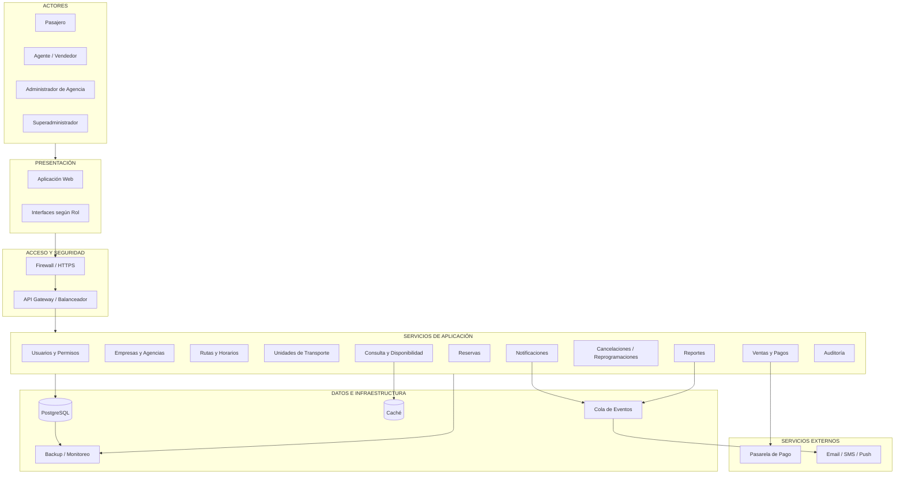

# Arquitectura Inicial del Sistema

## 1. Descripción

La arquitectura inicial de la Plataforma Integrada de Reservas y Gestión de Transporte Interprovincial parte de una separación lógica en capas y se complementa con componentes técnicos orientados a responder a los principales drivers arquitectónicos del sistema.

La solución debe soportar múltiples empresas y agencias, operaciones concurrentes de reserva, crecimiento progresivo de usuarios y servicios, integraciones externas y escenarios de alta demanda.

## 2. Tipo de arquitectura

La propuesta utiliza una **arquitectura distribuida organizada por capas y servicios**.

A nivel lógico se consideran tres capas principales:

1. Presentación.
2. Lógica de Negocio.
3. Datos.

A nivel técnico se incorporan componentes adicionales como API Gateway o balanceador, caché, procesamiento asíncrono, servicios externos, monitoreo y respaldo.

## 3. Componentes principales

### Actores

- Pasajero.
- Agente/Vendedor.
- Administrador de Agencia.
- Superadministrador.

### Presentación

- Aplicación Web.
- Interfaces según rol.

### Acceso

- Firewall / HTTPS.
- API Gateway / Balanceador de carga.

### Servicios de aplicación

- Usuarios y permisos.
- Empresas y agencias.
- Rutas y horarios.
- Unidades de transporte.
- Consulta y disponibilidad.
- Reservas.
- Ventas y pagos.
- Cancelaciones y reprogramaciones.
- Notificaciones.
- Reportes.
- Auditoría.

### Datos e infraestructura

- PostgreSQL.
- Caché.
- Cola de eventos.
- Backup y monitoreo.

### Sistemas externos

- Pasarela de pago.
- Servicio de notificaciones.

## 4. Diagrama de arquitectura inicial

## 5. Flujo principal

El usuario accede a la plataforma mediante la capa de presentación. Las solicitudes son recibidas a través de los mecanismos de acceso y seguridad y posteriormente dirigidas hacia los servicios de aplicación.

Los servicios ejecutan las reglas de negocio y acceden a PostgreSQL cuando requieren consultar o modificar información persistente. Las consultas frecuentes pueden utilizar el mecanismo de caché para reducir la carga sobre la base de datos.

Las tareas que no requieren ejecución inmediata, como determinadas notificaciones o procesos secundarios, pueden ser gestionadas mediante una cola de eventos.

Las operaciones de pago se integran con una pasarela externa y las notificaciones pueden utilizar servicios externos de correo electrónico, SMS o notificaciones push.

## 6. Relación entre drivers y arquitectura

| Driver | Decisión arquitectónica relacionada |
|---|---|
| **DA01 – Consistencia de reservas** | Persistencia transaccional y control de concurrencia en el proceso de reserva. |
| **DA02 – Rendimiento** | Uso de caché y optimización de consultas frecuentes. |
| **DA03 – Escalabilidad** | API Gateway/balanceador y separación de responsabilidades mediante servicios. |
| **DA04 – Disponibilidad** | Monitoreo, respaldo y mecanismos de recuperación. |
| **DA05 – Seguridad** | Firewall/HTTPS, autenticación, autorización y control de permisos. |
| **DA06 – Integración de pagos** | Integración desacoplada con una pasarela de pago externa. |
| **DA07 – Procesamiento asíncrono** | Incorporación de una cola de eventos. |
| **DA08 – Trazabilidad** | Servicio o mecanismo de auditoría y registro de operaciones críticas. |

## 7. Conclusión arquitectónica

La arquitectura propuesta mantiene una separación lógica en capas y complementa esta organización con componentes técnicos que responden a los principales drivers del sistema. Esta estructura permite representar de manera inicial cómo la plataforma puede soportar múltiples empresas y agencias, operaciones concurrentes, integraciones externas y crecimiento progresivo.