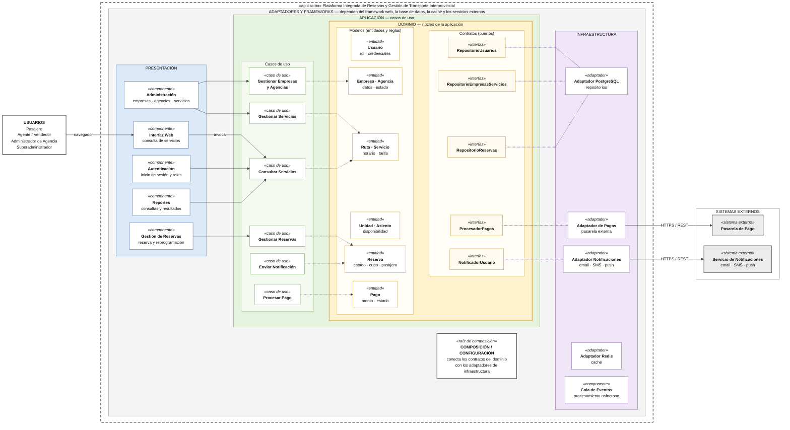

# Enfoque Arquitectónico

## 1. Descripción

Para la **Plataforma Integrada de Reservas y Gestión de Transporte Interprovincial** se adopta **Clean Architecture** como enfoque arquitectónico.

Este enfoque complementa el estilo arquitectónico definido previamente y permite organizar las responsabilidades internas del sistema de manera que las reglas principales del negocio permanezcan independientes de tecnologías específicas como bases de datos, frameworks, servicios externos o mecanismos de comunicación.

La regla principal establece que las dependencias deben orientarse hacia el núcleo de la aplicación.

---

## 2. Enfoque seleccionado: Clean Architecture

La solución se organiza en cuatro niveles principales:

### 2.1 Entidades / Dominio

Representa el núcleo de la aplicación y contiene las reglas principales del negocio.

Principales elementos:

- Usuario.
- Empresa de transporte.
- Agencia.
- Ruta.
- Unidad de transporte.
- Servicio programado.
- Asiento o cupo.
- Reserva.
- Pago.

En esta capa se encuentran las reglas críticas del sistema, especialmente aquellas relacionadas con disponibilidad, reservas y prevención de sobreventa.

---

### 2.2 Casos de Uso / Aplicación

Contiene las operaciones que la plataforma permite realizar.

Principales casos de uso:

- autenticar usuario;
- gestionar empresas y agencias;
- gestionar rutas y servicios;
- consultar servicios disponibles;
- consultar disponibilidad;
- crear reserva;
- confirmar reserva;
- cancelar o reprogramar reserva;
- procesar pago;
- enviar notificaciones;
- generar reportes.

Esta capa coordina las reglas del dominio para cumplir los requerimientos funcionales del sistema.

---

### 2.3 Adaptadores de Interfaz

Permiten comunicar los casos de uso con los mecanismos externos de entrada y salida.

Incluye:

- Controllers de la API REST.
- DTO y validadores.
- Interfaces de repositorios.
- Adaptadores de persistencia.
- Adaptador de pasarela de pago.
- Adaptador del servicio de notificaciones.

Los adaptadores transforman la información entre los formatos externos y los utilizados por la aplicación.

---

### 2.4 Frameworks e Infraestructura

Contiene las tecnologías y servicios concretos utilizados para ejecutar la solución.

Incluye:

- PostgreSQL.
- Redis.
- Cola de eventos.
- API REST.
- Pasarela de pago externa.
- Servicio de notificaciones.
- Autenticación y autorización.
- Monitoreo y auditoría.
- Mecanismos de respaldo y recuperación.

Estos componentes se encuentran en la parte externa de la arquitectura y no deben determinar las reglas principales del negocio.

---
## 3. Diagrama de Clean Architecture

El siguiente diagrama representa la aplicación de **Clean Architecture** en la Plataforma Integrada de Reservas y Gestión de Transporte Interprovincial. Las reglas del negocio permanecen en el dominio, mientras que los componentes tecnológicos y servicios externos se mantienen en las capas externas.

### Leyenda

| Representación | Significado |
|---|---|
| **→ Flecha continua** | Llamada o comunicación en tiempo de ejecución. |
| **⇢ Flecha punteada** | Dependencia de código: los casos de uso dependen de las entidades del dominio. |
| **Línea punteada morada** | El adaptador de infraestructura implementa el contrato (puerto) definido en el dominio. |
| **Presentación** | Interacción con los usuarios. |
| **Aplicación** | Casos de uso del sistema. |
| **Dominio** | Entidades, reglas de negocio y contratos. |
| **Infraestructura** | Implementaciones tecnológicas y adaptadores. |
| **Sistemas externos** | Servicios que se encuentran fuera de la plataforma. |

### Regla de dependencia

1. **El dominio no depende de infraestructura.**
2. **Los casos de uso dependen del dominio y sus contratos.**
3. **La infraestructura implementa los contratos definidos hacia el núcleo.**
4. **PostgreSQL, Redis, la pasarela de pago y los servicios de notificaciones permanecen fuera del dominio.**
5. **Los detalles tecnológicos pueden cambiar sin modificar las reglas principales del negocio.**
## 4. Aplicación al proyecto

Clean Architecture permite que las reglas principales de la plataforma permanezcan independientes de la infraestructura utilizada.

Por ejemplo, el proceso de reserva pertenece al núcleo funcional del sistema. La lógica que determina si un asiento se encuentra disponible y si una reserva puede ser confirmada no debe depender directamente de PostgreSQL, Redis o de la interfaz web.

De forma similar, el procesamiento de pagos se comunica con una abstracción definida por la aplicación. La implementación concreta de la pasarela de pago se mantiene en los adaptadores e infraestructura.

Esto permite sustituir o modificar tecnologías externas con menor impacto sobre las reglas del negocio.

---

## 5. Relación con el driver de mantenibilidad

El enfoque responde principalmente al:

**DA10 – Mantenibilidad:** el sistema debe permitir modificar o ampliar funcionalidades sin afectar innecesariamente otros módulos.

Clean Architecture contribuye a este driver mediante:

- separación de responsabilidades;
- control de dependencias;
- independencia del dominio respecto a tecnologías externas;
- facilidad para realizar pruebas;
- posibilidad de sustituir componentes de infraestructura;
- menor impacto ante cambios tecnológicos.

---

## 6. Relación entre estilo y enfoque

La arquitectura del proyecto queda definida de la siguiente manera:

| Elemento | Selección |
|---|---|
| **Estilo arquitectónico** | Arquitectura en capas |
| **Organización de la aplicación** | Monolito modular |
| **Enfoque arquitectónico** | Clean Architecture |
| **Comunicación** | API REST |
| **Persistencia principal** | PostgreSQL |
| **Caché** | Redis |
| **Procesamiento asíncrono** | Cola de eventos |

Por lo tanto, **Clean Architecture no reemplaza la arquitectura en capas ni el monolito modular**, sino que complementa la solución definiendo cómo deben organizarse las responsabilidades y dependencias internas.

---

## 7. Beneficios para la solución

La aplicación de Clean Architecture permite:

- mantener independientes las reglas del negocio;
- reducir el acoplamiento con tecnologías externas;
- facilitar el mantenimiento y evolución del sistema;
- mejorar la capacidad de prueba;
- permitir cambios de infraestructura con menor impacto;
- mantener una estructura organizada conforme crezca la plataforma.