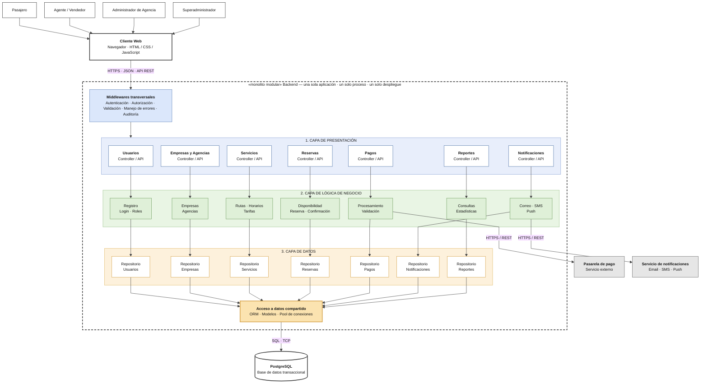

# Estilo Arquitectónico

## 1. Descripción

La **Plataforma Integrada de Reservas y Gestión de Transporte Interprovincial** adopta una arquitectura organizada en capas, implementada inicialmente como un **monolito modular**.

La solución separa las responsabilidades de presentación, aplicación, dominio e infraestructura, permitiendo mantener una estructura organizada y facilitar la evolución progresiva del sistema.

A nivel de despliegue, la aplicación podrá disponer de múltiples instancias distribuidas mediante un balanceador de carga para responder al crecimiento de usuarios y operaciones.

---

## 2. Estilo seleccionado

Se selecciona una **arquitectura en capas con organización modular**.

La aplicación se mantiene inicialmente como una única unidad desplegable, pero internamente se divide en módulos funcionales con responsabilidades claramente definidas.

Los principales módulos son:

- Usuarios.
- Empresas y agencias.
- Servicios.
- Reservas.
- Pagos.
- Notificaciones.
- Reportes.

Esta organización permite evitar la complejidad inicial de una arquitectura de microservicios, manteniendo al mismo tiempo separación de responsabilidades y capacidad de evolución.

---

## 3. Organización general

La arquitectura se organiza en los siguientes niveles:

### Capa de Presentación

Responsable de la interacción con los usuarios de la plataforma mediante la interfaz web.

Actores principales:

- Pasajero.
- Agente / Vendedor.
- Administrador de Agencia.
- Superadministrador.

### Capa de Aplicación

Coordina los casos de uso y operaciones de la plataforma.

Incluye funcionalidades relacionadas con:

- gestión de usuarios;
- gestión de empresas y agencias;
- gestión de servicios;
- búsqueda y disponibilidad;
- gestión de reservas;
- procesamiento de pagos;
- notificaciones;
- reportes.

### Capa de Dominio

Contiene las reglas principales del negocio relacionadas con:

- pasajeros;
- empresas;
- agencias;
- rutas;
- servicios;
- unidades;
- cupos o asientos;
- reservas;
- pagos.

Esta capa concentra las reglas que deben mantenerse independientes de tecnologías específicas.

### Capa de Infraestructura

Contiene los componentes tecnológicos necesarios para soportar la aplicación, entre ellos:

- PostgreSQL para persistencia;
- Redis para caché;
- cola de eventos para procesamiento asíncrono;
- integración con pasarela de pago;
- servicio de notificaciones;
- mecanismos de auditoría y monitoreo;
- respaldo y recuperación.

---

## 4. Relación con los drivers arquitectónicos

| Driver | Influencia sobre el estilo |
|---|---|
| **DA01 – Consistencia y concurrencia** | Requiere separar claramente la lógica de reservas y mantener persistencia transaccional. |
| **DA02 – Rendimiento** | Justifica el uso de caché para consultas frecuentes. |
| **DA03 – Escalabilidad** | Justifica una organización modular y la posibilidad de escalamiento horizontal. |
| **DA04 – Disponibilidad** | Justifica mecanismos de balanceo, monitoreo y recuperación. |
| **DA05 – Seguridad** | Requiere autenticación, autorización y protección de las comunicaciones. |
| **DA06 – Integración de pagos** | Requiere desacoplar la lógica del sistema de servicios externos. |
| **DA07 – Procesamiento asíncrono** | Justifica el uso de una cola de eventos para tareas secundarias. |
| **DA08 – Trazabilidad** | Requiere auditoría, logs y monitoreo. |
| **DA09 – API REST** | Define la comunicación entre la presentación y la aplicación. |
| **DA10 – Mantenibilidad** | Justifica la modularidad y la separación de responsabilidades. |

---

## 5. Diagrama del estilo arquitectónico

El siguiente diagrama representa la **arquitectura en capas implementada como un monolito modular** para la Plataforma Integrada de Reservas y Gestión de Transporte Interprovincial.

## 6. Justificación

La arquitectura en capas permite separar las responsabilidades del sistema y mantener una organización comprensible.

El **monolito modular** permite que las funcionalidades se encuentren separadas internamente sin introducir inicialmente la complejidad operativa de una arquitectura de microservicios.

Además, la aplicación puede escalar horizontalmente mediante múltiples instancias distribuidas a través de un balanceador de carga cuando la demanda lo requiera.

La organización interna será complementada mediante **Clean Architecture**, con el objetivo de controlar las dependencias entre el dominio, los casos de uso, los adaptadores y la infraestructura.