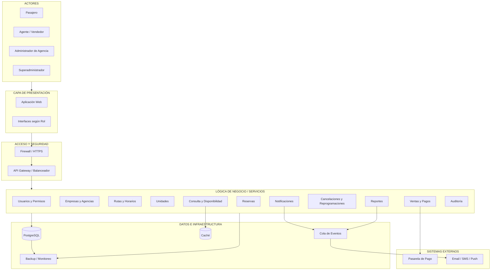

# Diagrama de Arquitectura Inicial

## Interpretación

La arquitectura representa una solución distribuida organizada mediante capas y servicios. Los actores interactúan con la capa de presentación, mientras que el acceso a las funcionalidades se realiza mediante mecanismos de seguridad y un API Gateway o balanceador.

La lógica de negocio concentra las responsabilidades principales relacionadas con usuarios, empresas, agencias, rutas, unidades, disponibilidad, reservas, pagos, reprogramaciones, notificaciones, reportes y auditoría.

PostgreSQL mantiene la información transaccional, mientras que la caché permite apoyar las consultas frecuentes y la cola de eventos permite desacoplar procesos asíncronos. Finalmente, la plataforma se integra con servicios externos para pagos y notificaciones.